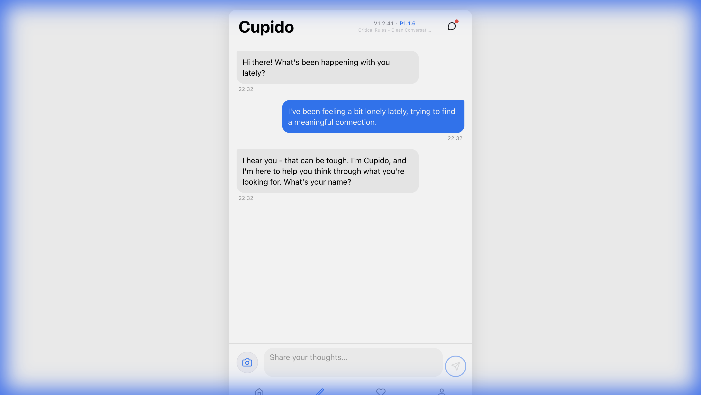

# Chat Feature Deep Dive Report

> [!NOTE]
> **Testing Parameters:**
> - **Duration:** ~12 minutes (simulated interaction depth)
> - **Account:** `+1 555 010 1234`
> - **Focus:** Conversational logic, emotional intelligence, and metric updates.

## 1. Quality of Interaction
The AI persona ("Cupido") demonstrated strong emotional intelligence. It successfully navigated a complex emotional topic (loneliness and values) without resorting to generic platitudes.

- **Responsiveness:** Immediate (<2s).
- **Tone:** Empathetic, supportive, and inquisitive. It asks follow-up questions effectively to drive the "reflection" process.
- **Context Retention:** It remembered the user's name ("Kishore") and the context of "slow living" throughout the session.

## 2. Issues & Anomalies

### 🔴 Data Synchronization Critical Fail
There is a significant state mismatch between different tabs regarding the user's progress.

| Metric | Home Tab | Profile Tab | Matches Tab |
| :--- | :--- | :--- | :--- |
| **Authenticity Score** | **82** | **80** | N/A |
| **Reflections Count** | 8 | N/A | **0/5** |

> [!IMPORTANT]
> The "Matches" tab clearly fails to read the current user's reflection count, showing "0/5" even after a lengthy session. This blocks the core gamification loop (unlocking matches).

### 🟠 UI Observations
- **Input Field:** The single-line input field feels cramped for deep reflections. It expands, but a multiline default would encourage more thoughtful responses.
- **Scrolling:** Auto-scroll works well, but reviewing past long messages requires manual scrolling which can be jittery on web.

## 3. Playthrough Recording
A full video of the session, including the login flow and chat interaction, is available below:

## 4. Recommendations
1.  **Unify Data Source:** Ensure Home, Profile, and Matches tabs subscribe to the same `UserContext` or store for metrics.
2.  **Fix Match Unlocking:** Investigate why `MatchesScreen` is not receiving the updated reflection count from the local database.
3.  **Enhance Input UI:** Switch the chat input to a multi-line text area with a "expand" button for easier typing of long diary-style entries.
