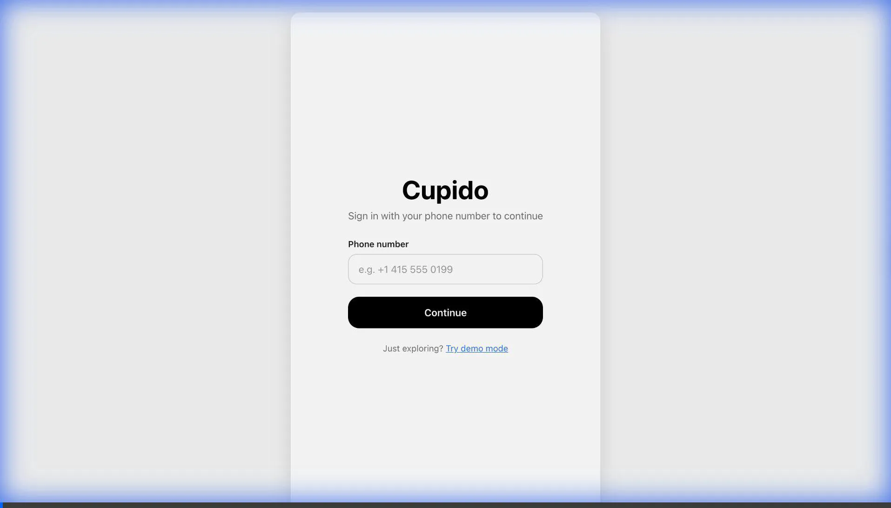
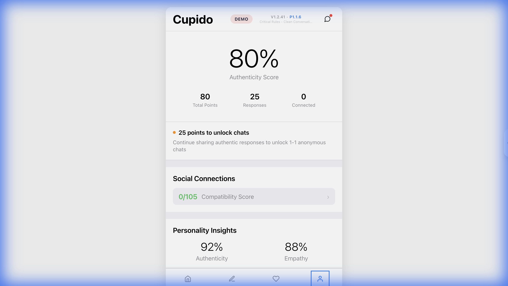
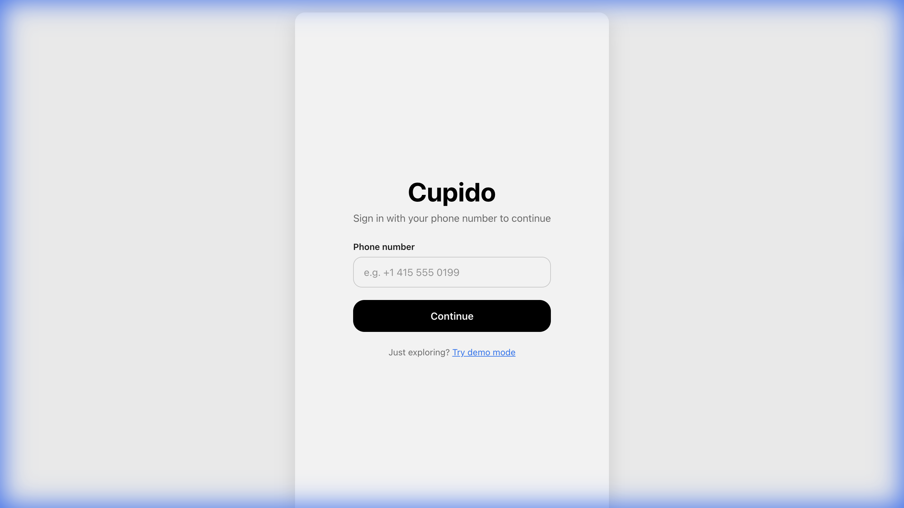
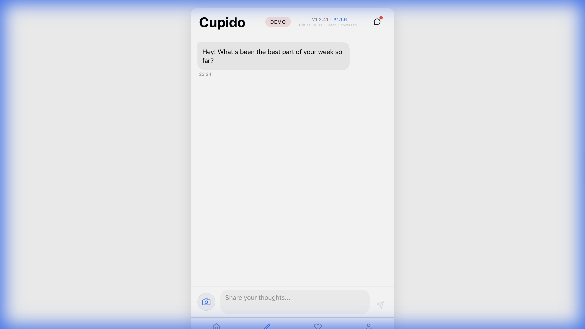

# UX Improvement Report: Cupido Application

> [!NOTE]
> This report is based on a local testing session of the Cupido application running on `http://localhost:8081`.

## 1. Executive Summary
The configuration was successfully validated, and the application is running smoothly. The "slow dating" concept based on daily reflections is compelling and unique. The UI is modern and clean, but several usability and consistency issues were identified that could hinder user retention and clarity.

## 2. Key Observations & Issues

### A. Consistency in Demo Mode
**Issue:** The state in "Demo Mode" is inconsistent. The Profile tab shows "25 Responses" and "80 Points," suggesting an active user, but the Matches tab states "0/5 reflections" are completed.
**Impact:** High. This confuses users trying to understand the app's progression system.
**Recommendation:** Ensure the Demo Mode state is synchronized across all tabs to simulate a realistic, "mid-journey" user experience.

| Profile Tab (Shows progress) | Matches Tab (Shows no progress) |
| :---: | :---: |
|  | *(Matches screen showed 0/5)* |

### B. Navigation & Accessibility
**Issue:** The bottom navigation bar uses icons only (Home, Edit, Heart, User). While standard, they lack text labels.
**Impact:** Medium. New users might find it slightly harder to learn the navigation map, especially the difference between "Home" (Dash) and "Edit" (Reflect).
**Recommendation:** Add small text labels (e.g., "Home", "Reflect", "Matches", "Profile") below the icons.

### C. Feature Discoverability
**Issue:** The "Community Feed" on the Home tab has a "Long press to reflect" interaction. Hidden gestures are hard to discover.
**Impact:** Medium. Users may miss a key engagement feature.
**Recommendation:** Add a small tooltip or a visual cue (e.g., a "Press & Hold" badge) on the first few items to teach the gesture.

### D. Contextual Integration
**Issue:** The "Connect professional energy" (LinkedIn) integration appears at the bottom of the Home feed without much context.
**Impact:** Low. It feels like an advertisement rather than a feature.
**Recommendation:** Add a brief distinct section header or explanation (e.g., "Enhance your profile with professional insights").

## 3. Visual Gallery

### Landing Page
Clean and minimalist. The "Try demo mode" link is a great fallback for testing.

### Chat / Reflection Interface
The conversational UI is smooth. The AI responds intelligently to inputs.

## 4. Next Steps
1.  **Fix Demo Mode State:** Align the mock data in `App.tsx` or the store to be consistent.
2.  **Enhance Navigation:** Add identifying labels to the bottom tab bar.
3.  **Gamification Polish:** Make the "Day Streak" more prominent on the Home screen to drive daily usage.
